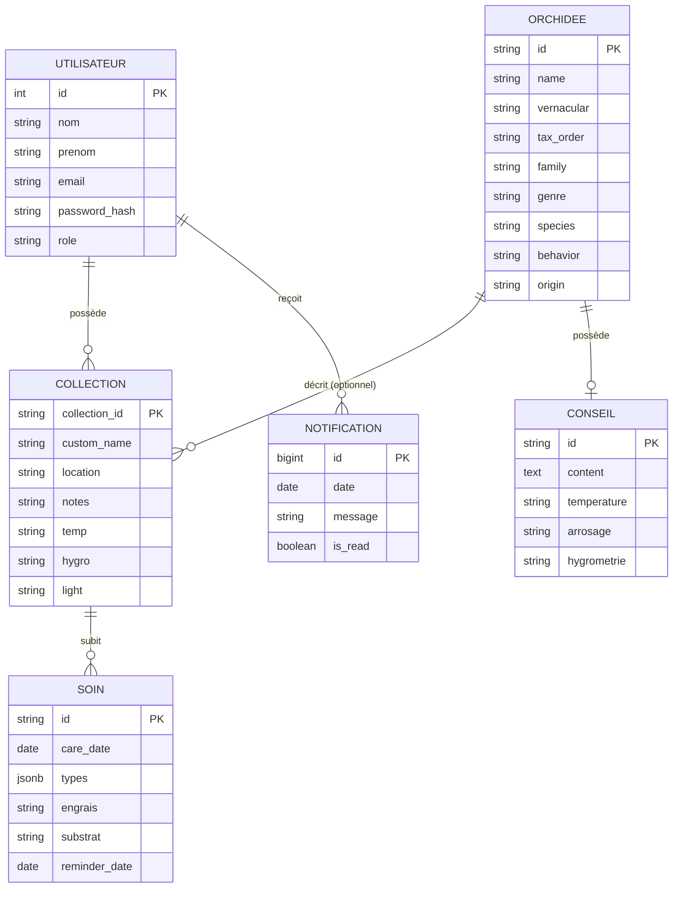

# Modélisation de la Base de Données "Mes Orchidées"

## Modèle Conceptuel de Données (MCD)

Le MCD représente les entités métiers et les relations sémantiques entre elles.

## Modèle Logique de Données (MLD)

Le MLD traduit le MCD en tables relationnelles (syntaxe PostgreSQL) :

- **users** (<u>id</u>, nom, prenom, email, password_hash, role, created_at, updated_at)
- **orchids** (<u>id</u>, name, vernacular, tax_order, family, subfamily, tribu, subtribu, genre, species, behavior, discovered, origin, img, short_desc, long_desc)
- **conseils** (<u>id</u>, #orchid_id, content, temperature, arrosage, hygrometrie, engrais)
- **user_collections** (<u>collection_id</u>, #user_id, #orchid_id, custom_name, img, behavior, added_at, location, notes, temp, hygro, light, ventilation)
- **care_history** (<u>id</u>, #collection_id, care_date, types, engrais, substrat, ravageurs, cycles, reminder_date)
- **notifications** (<u>id</u>, #user_id, date, message, is_read)

_Légende :_
<u>Clé primaire</u>
#Clé étrangère

## Dictionnaire de Données (Extraits principaux)

| Entité | Attribut | Type SQL | Contraintes | Description |
|---|---|---|---|---|
| users | email | VARCHAR(255) | UNIQUE, NOT NULL | Adresse email servant d'identifiant unique de connexion. |
| users | password_hash | VARCHAR(255) | NOT NULL | Mot de passe haché (Argon2id). |
| orchids | id | VARCHAR(100) | PRIMARY KEY | Identifiant sous forme de slug (ex: `acacalis_cyanea`). |
| user_collections | user_id | INTEGER | FK -> users(id) | L'utilisateur propriétaire de la plante. |
| user_collections | orchid_id | VARCHAR(100) | FK -> orchids(id), NULL | NULL si la plante ajoutée est personnalisée et non dans l'encyclopédie. |
| care_history | types | JSONB | - | Liste des actions effectuées (arrosage, rempotage, etc.). |
